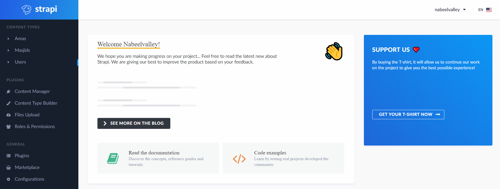
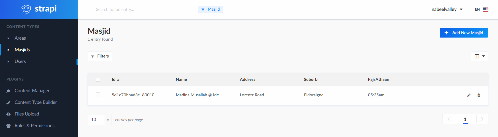
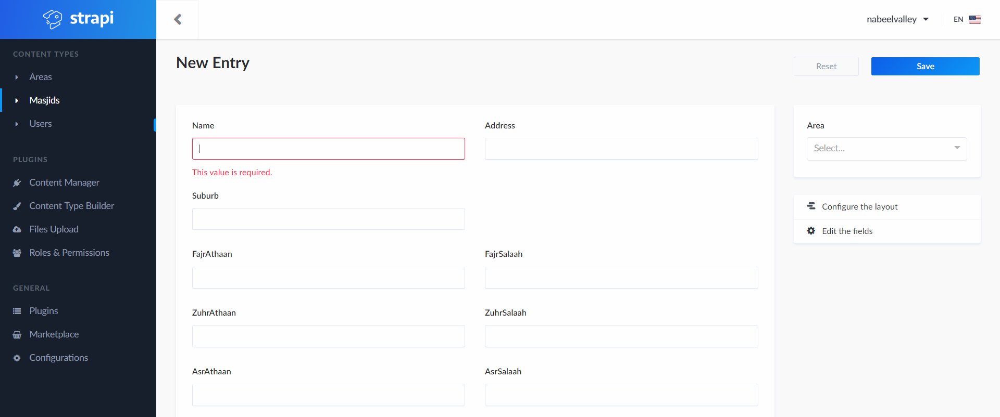
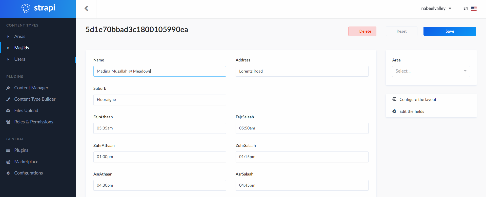

# Salaah Times App

## Running Develop

1. Ensure you are using `Node.js v10`
2. Install the dependencies in the `app` and `strapi` directories with `yarn`
3. Requires a Mongo Service to be running on `127.0.0.1:27017` (localhost)
4. Run the frontend from the `app` directory with `yarn start`
5. Run the strapi backend from the `strapi` directory with `yarn run develop`

Once ready, run `npm run develop`

## Create/Update Masjid Times

1. Open the `/admin` page of the Strapi Application ([live here](https://salaah-times.herokuapp.com/admin) and login)

2. After logging in you will see the homepage of the admin section. Now click on the `Masjids` link in the `Content-Types` section in the left panel.

> If you can only see the `Users` link it means that things did not load correctly, just do a hard refresh on your browser ([more information here](https://fabricdigital.co.nz/blog/how-to-hard-refresh-your-browser-and-clear-cache)) until you can see the same sections as above, and then click on `Masjids`

3. You should now see the Masjid listing screen below

4. Click on the blue `Add New Masjid` button at the top right to create a new Masjid

> If you would like to instead edit the times for an existing Masjid you can instead just click the row with the masjid details which will take you to the same edit screen as above

5. Fill in the relevant fields for the Masjid (all times are not required). Note that when filling in times to please use the am/pm format (eg. `05:30pm`) as can be seen in the example below

6. Once you are done entering the relevant details click the blue `Save` button at the top, and that's it.

## Exporting Times

If you want to export these times as a text format, this can be done by clicking on the `Salaah Times` heading in the app view. The times will then be copied to your clipboard and you can paste them wherever you like

## Bugs

- Does not load content if the home page was not loaded first

## To Do

[X] Create server to handle JSON _times_ requests from React App

[X] Build frontend with React for the masjid listing

[X] Cache network requests with PWA

[X] Configure build and deploy pipeline

[ ] Decide how long the |js|css|html| files should be cached

[X] Refactor to an **actual** db (or at least provide a plugin that can be modified easily at a later stage)

[X] Consider using a custom theme

[ ] Look at PWA notifications

[ ] Add announcement functionality

## Deployment

### Strapi

Strapi is deployed as a Node.js application to Heroku, in order to set up the application you will need to do the following from the repository root directory:

1. `heroku login`
2. `heroku git:remote -a salaah-times-backend`
3. Run the `heroku-deploy.ps1` script to deploy the application
4. You will also need to configure the following:
   1. `NODE_ENV` - This should be set to `development` so Gatsby can infer the schema during build
   2. `DATABASE_URI` - MongoDB connection string
   3. `MASJID_CHANGE_WEBHOOK` - Webhook to trigger frontend build

### App

The frontend application is deployed as a Gatsby site to Netlify, this will automatically deploy when the application is pused, however a deploy will also be triggered when Strapi is updated via the Strapi Webhook functionality

The frontend application requires the `STRAPI_BASE_URL` to be set as an environment variable **without the trailing `/`**

## Resources

Salaah times from
https://www.salahtimes.com/south-africa/pretoria

Convert to JSON
https://www.csvjson.com/csv2json
